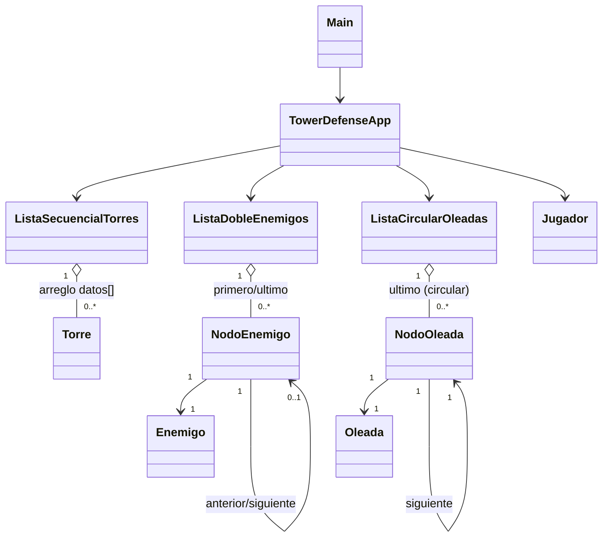

# Estructura_Datos_PRUEBA

# Tower Defense — Estructura de Datos (Java)

Prueba práctica de Estructura de Datos (UTA): simulador Tower Defense con las tres
estructuras exigidas, implementadas manualmente (sin `java.util`).

## Estructura del repositorio

```
Estructura_Datos_PRUEBA/
├── Capturas_Ejecucion/
│   └── ejemplo                    → capturas de pantalla de la ejecución
├── Diagrama de clases/
│   └── Diagrama UML del Examen    → diagrama de clases del proyecto
├── Scr_java/                      → código fuente (.java)
│   ├── Enemigo.java
│   ├── Jugador.java
│   ├── ListaCircularOleadas.java
│   ├── ListaDobleEnemigos.java
│   ├── ListaSecuencialesTorres.java
│   ├── Main.java
│   ├── NodoEnemigo.java
│   ├── NodoOleada.java
│   ├── Oleada.java
│   ├── Torre.java
│   └── TowerDefenseApp.java
├── .gitignore
└── README.md
```

> Nota: Java exige que el nombre de la clase pública coincida exactamente con el nombre del
> archivo. Si `ListaSecuencialesTorres.java` se subió con la clase todavía declarada como
> `ListaSecuencialTorres`, no va a compilar — hay que igualar uno de los dos nombres.

## Compilar y ejecutar

```bash
cd Scr_java
javac *.java -d ../bin
java -cp ../bin TowerDefenseApp
```

`Main.java` es un punto de entrada alterno: solo invoca `TowerDefenseApp.main()`, por si el
entorno de ejecución espera una clase `Main` (`java -cp ../bin Main`). El `main` exigido por
el enunciado sigue estando en `TowerDefenseApp`.

## Reparto del equipo (6 integrantes)

| Integrante                        | Rol                         | A cargo de                                                                                                                                                               |
| --------------------------------- | --------------------------- | ------------------------------------------------------------------------------------------------------------------------------------------------------------------------ |
| Cunalata Mendoza Damian Alexander | Líder técnico e integración | `TowerDefenseApp` (menú + lógica de "avanzar turno") + `Main`, `Jugador`, `ListaCircularOleadas` + `NodoOleada` + `Oleada`, compilación final y prueba del caso sugerido |
| Chalco Tasna Kenneth Mateo        | Desarrollo                  | `Torre` + `ListaSecuencialTorres` (insertar, eliminar, buscar, mostrar, contar)                                                                                          |
| Tacuri Santillan Mónica Sara      | Desarrollo                  | `Torre` + `ListaSecuencialTorres`: (lista vacía, llena, id repetido (la integrante no llegó a tiempo y no realizó su parte))                                             |
| Tisalema Guashco Darwin Joel      | Desarrollo                  | `Enemigo` + `NodoEnemigo` + `ListaDobleEnemigos` (insertar, eliminar, buscar, recorridos, actualización de posición)                                                     |
| Silva Camuendo Luis Alexander     | Desarrollo                  | `Enemigo` + `NodoEnemigo` + `ListaDobleEnemigos`: (lista vacía, un nodo, cabeza/cola)                                                                                    |
| Camacho Monta Josue Jampier       | Documentación               | Este README (generación y mantenimiento), diagrama de clases, explicación de cada estructura, capturas de pantalla de la ejecución                                       |

Cada pareja de desarrollo cubre su propia estructura de punta a punta (código + pruebas);
el líder integra todo en `TowerDefenseApp` y valida que el caso de prueba sugerido funcione
antes de la entrega; Josue documenta el proyecto completo en este mismo README, incluido
el diagrama de clases.

## Breve explicación del uso de cada estructura de datos

| Estructura                                                                    | Dónde                   | Por qué                                                                                                                                            |
| ----------------------------------------------------------------------------- | ----------------------- | -------------------------------------------------------------------------------------------------------------------------------------------------- |
| **Lista secuencial** (`Torre[] datos` + `cantidad`)                           | `ListaSecuencialTorres` | Pocas torres, se recorren completas cada turno; O(1) insertar al final.                                                                            |
| **Lista doble con primero/último** (`NodoEnemigo` con `anterior`/`siguiente`) | `ListaDobleEnemigos`    | Los enemigos se destruyen o retiran constantemente; eliminar un nodo ya ubicado es O(1) sin desplazar nada, y permite recorrido en ambos sentidos. |
| **Lista circular simple con referencia a último** (`NodoOleada`)              | `ListaCircularOleadas`  | El `siguiente` del último apunta al primero: el ciclo de oleadas avanza y se reinicia sin lógica especial.                                         |

### Lista secuencial de torres (`ListaSecuencialTorres`)

Guarda las torres defensivas en un arreglo `Torre[] datos` de capacidad fija, con un contador
`cantidad` que marca cuántas posiciones están ocupadas (siempre `datos[0 .. cantidad-1]`).
`insertarTorre` agrega al final en O(1) si hay espacio y el id no existe; `buscarTorrePorId`
recorre linealmente hasta encontrar el id (O(n)); `eliminarTorrePorId` localiza la posición y
desplaza los elementos siguientes una posición a la izquierda para no dejar huecos (O(n));
`mostrarTodasLasTorres` recorre la zona ocupada e imprime cada torre; `contarTorresActivas`
simplemente devuelve `cantidad`, porque toda torre presente en el arreglo está activa. Se eligió
por ser el número de torres siempre pequeño y por recorrerse por completo en cada turno (para
verificar rango), donde el costo de un arreglo compacto es despreciable frente a su simplicidad.

### Lista doblemente enlazada de enemigos (`ListaDobleEnemigos`)

Cada enemigo activo vive en un `NodoEnemigo` con referencias a `anterior` y `siguiente`, y la
lista mantiene `primero` y `ultimo` para insertar y recorrer sin recorrer todo el camino.
`insertarEnemigoAlFinal` engancha el nuevo nodo tras `ultimo` en O(1); `buscarEnemigoPorId`
recorre desde `primero` hasta encontrar el id (O(n)); `eliminarEnemigoDestruido` reenlaza
`anterior.siguiente` y `siguiente.anterior` alrededor del nodo eliminado, sin desplazar ningún
otro elemento (O(1) una vez localizado el nodo); `recorrerHaciaAdelante` y `recorrerHaciaAtras`
recorren la lista desde `primero` o desde `ultimo` respectivamente, usando las dos referencias
del nodo. Se eligió esta estructura porque los enemigos se agregan y eliminan constantemente en
cada turno, y un arreglo obligaría a desplazar elementos en cada baja; el doble enlace también
es indispensable para exigir el recorrido bidireccional que pide el enunciado.

### Lista circular simple de oleadas (`ListaCircularOleadas`)

Los `NodoOleada` solo tienen `siguiente`, pero el `siguiente` del último nodo apunta siempre al
primero, formando un círculo; la lista guarda la referencia `ultimo` (no hace falta `primero`,
porque `ultimo.siguiente` ya lo es). `registrarOleada` inserta el nuevo nodo justo después de
`ultimo` y lo convierte en el nuevo `ultimo`, preservando la circularidad; `mostrarOleadas`
recorre el círculo una sola vez con un `do-while` que se detiene al volver al nodo de inicio;
`avanzarSiguienteOleada` mueve un puntero `actual` al siguiente nodo (al primero, la primera
vez) para saber qué oleada toca iniciar; `reiniciarCiclo` limpia ese puntero para volver a
empezar desde la primera oleada registrada. Se eligió esta estructura porque las oleadas se
repiten en ciclo por diseño del juego, y la circularidad evita tener que programar aparte la
lógica de "volver al inicio" cuando se termina la última oleada.

## Diagrama de clases



El diagrama UML entregado como imagen está en `Diagrama de clases/Diagrama UML del Examen`.

## Lógica de "Avanzar turno" (opción 7)

1. Mueve enemigos según su velocidad.
2. Cada torre daña a los enemigos dentro de su rango (`Torre.enRango`, distancia absoluta).
3. Elimina los enemigos cuya vida llegó a 0.
4. Descuenta una vida al jugador por cada enemigo que llegó al final del camino (`LONGITUD_RUTA = 20`) y lo retira.
5. Imprime el resumen del turno.

La partida termina por derrota (0 vidas) o victoria (todas las oleadas iniciadas y sin enemigos activos).

## Caso de prueba sugerido — verificado

Torre Arquero (pos 3, daño 20, rango 2), Torre Cañón (pos 8, daño 35, rango 3), Oleada de
3 básicos (vida 50, vel 1), Oleada de 2 rápidos (vida 40, vel 2), jugador con 3 vidas.
Compilado y ejecutado: el Arquero entra en rango desde el primer turno y destruye a los
tres enemigos básicos en el turno 3 (50 → 30 → 10 → 0), sin pérdida de vidas.

## Checklist de entregables

- [x] Archivos `.java` compilables y ejecutables — carpeta `Scr_java/`.
- [x] Capturas de pantalla de la ejecución — carpeta `Capturas_Ejecucion/` — **Josue**.
- [x] Explicación breve de cada estructura (arriba) — **Josue**.
- [x] Diagrama de clases (arriba y en `Diagrama de clases/`) — **Josue**.
- [ ] Invitar al docente (`joseru82@hotmail.com`) como colaborador del repositorio — **Damian**.

## Restricciones respetadas

Sin `ArrayList`, `LinkedList`, `Queue`, `Deque` ni colecciones de `java.util`. Listas
implementadas manualmente con arreglos y referencias entre objetos. Clases separadas en
archivos `.java`, con `TowerDefenseApp` conteniendo `main`.
